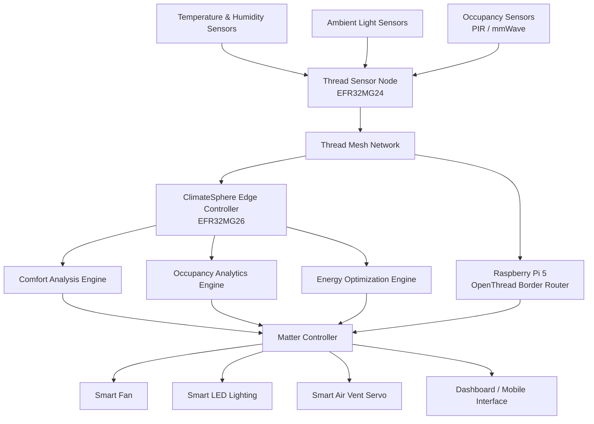
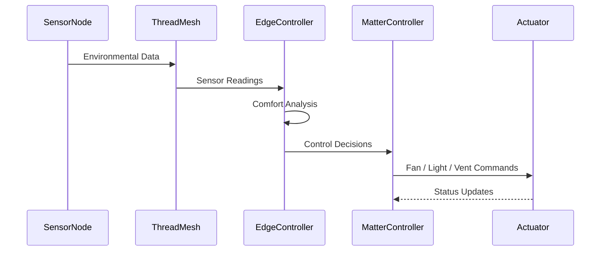
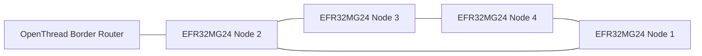
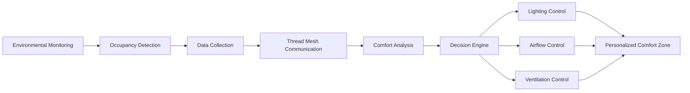

# ClimateSphere

### Personalized Indoor Comfort Through Thread, Matter, and Edge Intelligence

## Project Overview

ClimateSphere is an occupancy-aware indoor environmental control system that creates personalized micro-climate zones within shared spaces such as offices, classrooms, libraries, and co-working environments.

Traditional HVAC and lighting systems typically treat an entire room as a single zone, often resulting in uneven comfort levels and unnecessary energy consumption. ClimateSphere addresses this challenge by continuously monitoring temperature, humidity, ambient light, and occupancy conditions through a network of Silicon Labs EFR32MG24-based Thread sensor nodes.

Environmental data is transmitted over a self-healing Thread mesh network to an EFR32MG26 Edge Controller, where local intelligence analyzes room conditions and occupancy patterns. Based on these insights, Matter-enabled devices such as smart fans, lighting systems, and ventilation controls automatically adjust environmental conditions around occupied areas.

By conditioning only the spaces that are actively being used, ClimateSphere improves occupant comfort while reducing energy waste.

---

## Real-World Example

Consider an office with multiple workstations:

* Desk A is occupied and the user prefers a cooler environment.
* Desk B is occupied with standard comfort requirements.
* Desk C is currently vacant.

ClimateSphere detects occupancy and environmental conditions at each desk, increasing airflow around Desk A while maintaining normal conditions at Desk B and disabling localized conditioning at Desk C. This provides personalized comfort without unnecessarily cooling the entire office.

---

## Key Features

* Personalized micro-climate zones
* Occupancy-aware environmental control
* Thread mesh networking
* Matter interoperability
* Adaptive lighting control
* Localized airflow management
* Real-time environmental monitoring
* Edge-based comfort analytics
* Energy-efficient operation
* Scalable multi-zone deployment

---

## Benefits

* Enhanced occupant comfort
* Reduced HVAC energy consumption
* Efficient utilization of indoor resources
* Seamless integration with Matter ecosystems
* Reliable Thread mesh communication
* Local decision-making with minimal cloud dependency

---

## Target Applications

* Smart Offices
* Educational Institutions
* Libraries
* Co-working Spaces
* Commercial Buildings
* Smart Homes
* Research Laboratories

ClimateSphere demonstrates how modern IoT technologies can combine environmental sensing, wireless mesh networking, and intelligent automation to create more comfortable and energy-efficient indoor spaces.

# 2. Technical Architecture

## System Architecture

---

## Data Flow Architecture

---

## Thread Network Topology

---

## Functional Workflow

---

# 3. Technologies Used

## Wireless Technologies

* Thread 1.3
* Matter 1.4
* IEEE 802.15.4
* IPv6 Networking
* OpenThread

### Silicon Labs Technologies

* Gecko SDK (GSDK)
* Matter SDK
* OpenThread Stack
* CMSIS-NN

### Edge Intelligence Technologies

* TensorFlow Lite Micro
* TinyML
* Edge Inference

### Programming Languages

* C
* C++
* Python
* JavaScript
* ReactJS

### Development Tools

* Simplicity Studio 6
* Visual Studio Code
* Git
* GitHub
* Node-RED
* Silicon Labs Network Analyzer
* Silicon Labs Energy Profiler

---

# 4. Hardware Components

## Silicon Labs Hardware

### Sensor Nodes

| Component              | Quantity | Purpose             |
| ---------------------- | -------- | ------------------- |
| EFR32MG24 Explorer Kit | 3–5      | Thread Sensor Nodes |

### Edge Controller

| Component                 | Quantity | Purpose                                     |
| ------------------------- | -------- | ------------------------------------------- |
| EFR32MG26 Development Kit | 1        | Edge Controller and Environmental Analytics |

### Wireless Communication

| Component                      | Purpose                   |
| ------------------------------ | ------------------------- |
| Integrated IEEE 802.15.4 Radio | Thread Mesh Communication |

---

## Sensors

### Environmental Sensors

| Sensor   | Function                            |
| -------- | ----------------------------------- |
| Si7021   | Temperature and Humidity Monitoring |
| VEML7700 | Ambient Light Monitoring            |

### Occupancy Sensors

| Sensor                   | Function                    |
| ------------------------ | --------------------------- |
| PIR Motion Sensor        | Basic Occupancy Detection   |
| LD2410 mmWave Sensor     | Presence Detection          |

---

## Actuators

| Device            | Function                  |
| ----------------- | ------------------------- |
| Smart Fan         | Localized Airflow Control |
| Smart LED Light   | Adaptive Lighting         |
| SG90 Servo Motor  | Vent Direction Control    |

---

## External Hardware

| Hardware                      | Purpose                                        |
| ----------------------------- | ---------------------------------------------- |
| Raspberry Pi 5                | OpenThread Border Router and Matter Controller |
| Breadboard                    | Prototyping                                    |
| Jumper Wires                  | Hardware Interconnections                      |
| USB Power Supply              | Development Power                              |
| 18650 Battery Pack (Optional) | Portable Deployment                            |
| Battery Charger Module        | Battery Management                             |

---

## Development and Testing Equipment

| Tool               | Purpose                 |
| ------------------ | ----------------------- |
| Digital Multimeter | Electrical Measurements |
| USB Debug Adapter  | Firmware Programming    |

---

# 7. Software Components / Dependencies

## Silicon Labs Dependencies

| Component         | Version                          |
| ----------------- | -------------------------------- |
| Simplicity Studio | 6.x                              |
| Gecko SDK (GSDK)  | v2025.6 or Latest Stable Release |
| OpenThread SDK    | Included with GSDK               |
| Matter SDK        | Included with GSDK               |

---

## Silicon Labs Reference Applications

| Example Application       | Purpose                    |
| ------------------------- | -------------------------- |
| Matter Lighting Example   | Matter Device Development  |
| OpenThread CLI Example    | Thread Network Development |
| Sensor Monitoring Example | Environmental Monitoring   |

---

## External Software Dependencies

| Software              | Purpose                  |
| --------------------- | ------------------------ |
| TensorFlow Lite Micro | Edge Intelligence        |
| Node-RED              | Dashboard Development    |
| Mosquitto MQTT Broker | Messaging Infrastructure |
| Python 3.x            | Data Processing          |
| Git                   | Version Control          |
| GitHub Actions        | CI/CD Automation         |

---

## Operating Systems

| Platform                | Operating System          |
| ----------------------- | ------------------------- |
| Raspberry Pi 5          | Raspberry Pi OS           |
| Development Workstation | Windows 11 / Ubuntu Linux |

---

# 8. Licensing

## Project License

**Apache License 2.0**

ClimateSphere is released under the Apache License Version 2.0.
---

## Third-Party Licenses

| Component             | License       |
| --------------------- | ------------- |
| OpenThread            | BSD-3-Clause  |
| Matter SDK            | Apache 2.0    |
| TensorFlow Lite Micro | Apache 2.0    |
| Node-RED              | Apache 2.0    |
| Mosquitto MQTT        | EPL 2.0 / EDL |
| CMSIS-NN              | Apache 2.0    |

---

# 9. Maintainers / Contacts

| Name        | Role                             | Contact Information                                                                                                                | GitHub Profile                   |
| ----------- | -------------------------------- | ---------------------------------------------------------------------------------------------------------------------------------- | -------------------------------- |
| Shubhi Garg | Project Maintainer and Developer | [gargshubhi464@gmail.com](mailto:gargshubhi464@gmail.com) [shubhi.garg_ec23@gla.ac.in](mailto:shubhi.garg_ec23@gla.ac.in) | https://github.com/shubhi-garg27 |

---

